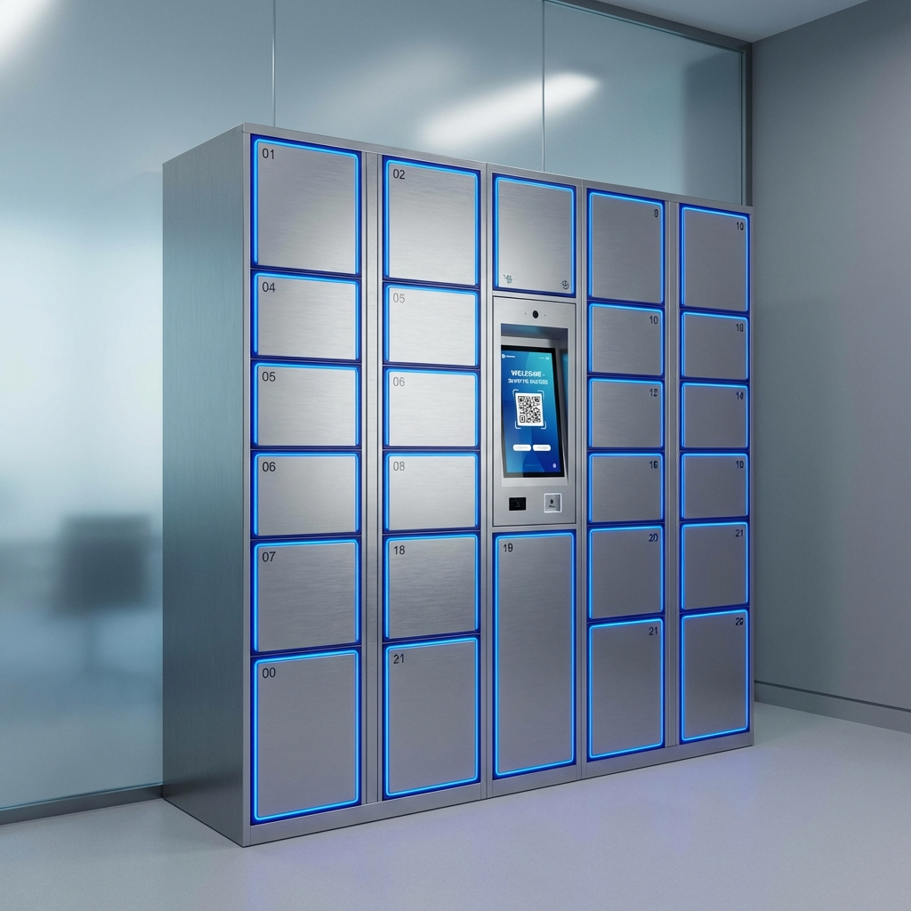
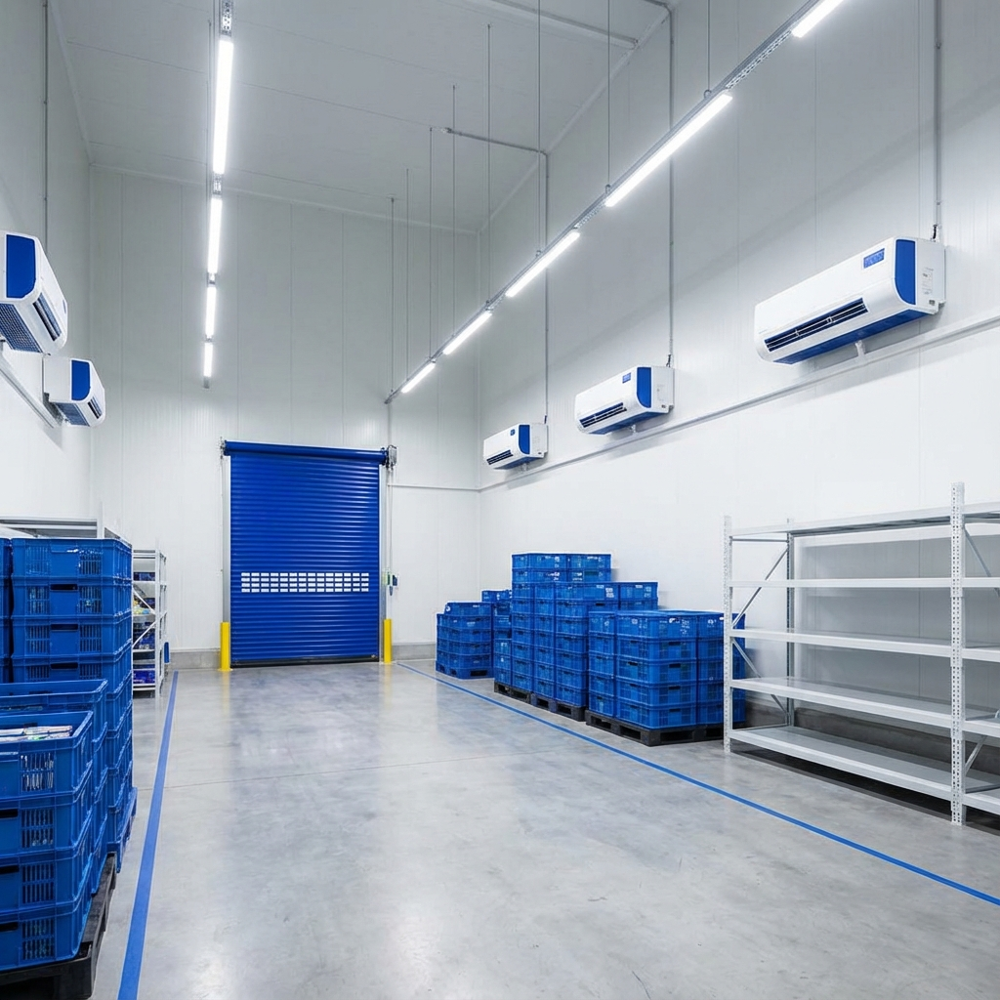

<div align="center">

# 🏭 Multi-Stock Logistics Platform

### Enterprise-Grade Warehouse & Logistics Management System

[](https://djangoproject.com)
[](https://python.org)
[](https://sqlite.org)
[](https://ashstarfall01.pythonanywhere.com)
[](LICENSE)

**[🌐 Live Demo](https://ashstarfall01.pythonanywhere.com)** &nbsp;•&nbsp; **[🐛 Report Bug](https://github.com/AshishCherian15/Multi-Stock-Logistics-Platform/issues)** &nbsp;•&nbsp; **[💡 Request Feature](https://github.com/AshishCherian15/Multi-Stock-Logistics-Platform/issues)**

---

> *Final Year B.E. Computer Science & Engineering Project — 2025–26 | USN: 4KM22CS018*

</div>

---

## 📋 Table of Contents

- [About](#-about)
- [Features](#-features)
- [Tech Stack](#-tech-stack)
- [Quick Start](#-quick-start)
- [Screenshots](#-screenshots)
- [Login Credentials](#-login-credentials)
- [Project Structure](#-project-structure)
- [Frontend Deployment](#-frontend-deployment)
- [Database Management](#-database-management)
- [API Reference](#-api-reference)
- [Troubleshooting](#-troubleshooting)
- [Author](#-author)

---

## 🧠 About

**Multi-Stock Logistics Platform** is a comprehensive, production-ready warehouse and logistics management system built with Django and PostgreSQL backend, with a Next.js frontend for modern deployment. It covers the full lifecycle of a logistics business — from inventory tracking and multi-vendor marketplace to equipment rentals, smart locker bookings, POS billing, analytics dashboards, and customer support.

Built as a Final Year CS Engineering project, it demonstrates enterprise software engineering patterns: role-based access control, RESTful APIs, signal-driven data consistency, audit logging, real-time notifications, and a clean multi-app Django architecture with 40+ apps.

---

## ✨ Features

### 🛒 Marketplace & Commerce
- Multi-vendor marketplace with search and filters
- Shopping cart with real-time stock validation
- Order lifecycle management (Pending → Confirmed → Shipped → Delivered)
- Product reviews with star ratings
- Wishlist and coupon system

### 🏗️ Warehouse Operations
- Inventory tracking with stock levels and movements
- Barcode & QR code generation
- Stock adjustments with approval workflow
- Multi-location warehouse support
- Bulk CSV upload

### 📦 Rentals, Storage & Lockers
- Equipment rental with flexible pricing (hourly/daily/weekly/monthly)
- Storage units booking by size and duration
- Smart lockers with booking management
- Automated rental agreements

### 💳 Payments & Billing
- Unified payment flow for all services
- Invoice and receipt generation
- Payment history tracking
- Refund processing workflow

### 📊 Analytics & Reporting
- Dashboard charts with Chart.js
- Advanced analytics with heatmaps
- Exportable CSV and XLSX reports
- Complete audit logging

### 💬 Communication & Support
- Support ticket system
- Internal messaging (1:1 and group chat)
- Community forums
- In-app notifications with email integration

---

## 🛠️ Tech Stack

| Layer | Technology |
|-------|-----------|
| Backend | Django 4.2.11, Django REST Framework 3.15 |
| Database | SQLite (included in repo — zero setup needed) |
| Frontend | Django HTML templates, Bootstrap 5, Chart.js |
| Authentication | Django session auth + DRF Token auth |
| Static Files | WhiteNoise (compressed, cached) |
| Barcode/QR | python-barcode 0.15, qrcode 7.4 |
| Deployment | PythonAnywhere (live at ashstarfall01.pythonanywhere.com) |

---

## 🚀 Quick Start

### Prerequisites
- Python 3.11+
- pip
- Git

### Backend Setup (Django)

```bash
# Clone repository
git clone https://github.com/AshishCherian15/Multi-Stock-Logistics-Platform.git
cd Multi-Stock-Logistics-Platform

# Create virtual environment
python -m venv venv
source venv/bin/activate  # Windows: venv\Scripts\activate

# Install dependencies
pip install -r requirements.txt

# Configure environment
cp .env.example .env
# Edit .env and set SECRET_KEY

# Generate secret key
python -c "import secrets; print(secrets.token_urlsafe(50))"

# Run migrations
python manage.py migrate

# Create superuser
python manage.py createsuperuser

# Seed demo data (optional)
python manage.py populate_data
python manage.py seed_rentals
python manage.py seed_storage
python manage.py seed_lockers

# Run development server
python manage.py runserver
```

Visit **http://127.0.0.1:8000**

### Use the Included Demo Database (Optional)

This repository already includes `db.sqlite3` with preloaded demo data.

```bash
# If you want to use the included DB directly, just run:
python manage.py runserver
```

If you want a fresh database instead, delete `db.sqlite3`, then run `python manage.py migrate` and seed commands.

### Frontend Setup (Next.js)

```bash
# Navigate to frontend directory
cd frontend-vercel

# Install dependencies
npm install

# Run development server
npm run dev
```

Visit **http://localhost:3000**

---

## 🖼️ Screenshots

### Platform Preview Assets

| Module | Preview |
|--------|---------|
| Rental Equipment |  |
| Smart Lockers |  |
| Storage Units |  |

You can also capture your local UI screenshots after running both servers and add them under a folder like `docs/screenshots/`.

---

## 🔐 Login Credentials

### 🌐 Access URLs

**Django Backend (Local):**
- Main: `http://127.0.0.1:8000/`
- Login Selection: `http://127.0.0.1:8000/auth/login-selection/`
- Team Login: `http://127.0.0.1:8000/auth/team-login/`
- Customer Login: `http://127.0.0.1:8000/auth/customer-login/`
- Guest Access: `http://127.0.0.1:8000/guest/`

**Live Site:**
- `https://ashstarfall01.pythonanywhere.com/`

### 👥 Team Login Credentials

#### 🔴 SuperAdmin Accounts
**Full system access & management**

| Username | Password | Email |
|----------|----------|-------|
| `superuser` | `super123` | superuser@multistock.com |
| `testcustomer` | `super123` | testcustomer@multistock.com |

#### 🔵 Admin Accounts
**Administrative access**

| Username | Password | Email |
|----------|----------|-------|
| `admin` | `admin123` | admin@multistock.com |
| `admin_rajesh` | `admin123` | rajesh@multistock.com |
| `admin_priya` | `admin123` | priya@multistock.com |

#### 🟡 SubAdmin Accounts
**Supervisor access**

| Username | Password | Email |
|----------|----------|-------|
| `subadmin_suresh` | `sub123` | suresh@multistock.com |
| `senior_lakshmi` | `staff123` | lakshmi.senior@multistock.in |

#### 🟠 Staff Accounts
**Basic operations**

| Username | Password | Email |
|----------|----------|-------|
| `staff` | `staff123` | staff@multistock.com |
| `staff_amit` | `staff123` | amit@multistock.com |
| `staff_vikram` | `staff123` | vikram@multistock.com |

### 🛒 Customer Login Credentials

| Username | Password | Email |
|----------|----------|-------|
| `customer` | `customer123` | customer@example.com |
| `customer_arjun` | `customer123` | arjun@example.com |
| `customer_deepika` | `customer123` | deepika@example.com |

**Plus 46+ more customer accounts** (all with password: `customer123`)

### 🌍 Guest Access
No login required - browse-only access at `/guest/`

**📄 Complete credentials documentation:** See [CREDENTIALS.md](CREDENTIALS.md)

---

## 📁 Project Structure

```
Multi-Stock-Logistics-Platform/
├── apps/                       # Django apps (40+ apps)
│   ├── auth_system/           # Login, register, password reset
│   ├── orders/                # Sales & purchase orders
│   ├── rentals/               # Equipment rental system
│   ├── storage/               # Storage unit bookings
│   ├── lockers/               # Smart locker system
│   ├── payments/              # Unified payment processor
│   ├── tickets/               # Support ticket system
│   ├── reviews/               # Product reviews
│   ├── inventory/             # Inventory management
│   ├── analytics/             # Dashboard & metrics
│   └── ...                    # 30+ more apps
├── templates/                # Django HTML templates (role-aware UI)
├── static/                   # CSS, JS, images
├── media/                    # Uploaded files
├── fixtures/                 # Seed data
├── greaterwms/              # Django project settings & URLs
├── db.sqlite3               # Pre-seeded demo database (included)
├── CREDENTIALS.md           # Complete login credentials
├── requirements.txt         # Python dependencies
├── manage.py
└── README.md
```

---

## 🌐 Deployment (PythonAnywhere)

This project is live at **https://ashstarfall01.pythonanywhere.com**

### Deploy Your Own Free Instance

1. **Sign up** at [pythonanywhere.com](https://www.pythonanywhere.com) (free tier)
2. **Open a Bash console** and run:
```bash
git clone https://github.com/AshishCherian15/Multi-Stock-Logistics-Platform.git
cd Multi-Stock-Logistics-Platform
python3.11 -m venv ~/.virtualenvs/multistock-env
source ~/.virtualenvs/multistock-env/bin/activate
pip install -r requirements.txt
python manage.py collectstatic --noinput
```
3. **Create a Web App** (Manual config, Python 3.11)
4. **WSGI file** — replace contents with:
```python
import os, sys
path = '/home/YOUR_USERNAME/Multi-Stock-Logistics-Platform'
if path not in sys.path:
    sys.path.append(path)
os.environ['DJANGO_SETTINGS_MODULE'] = 'greaterwms.settings'
from django.core.wsgi import get_wsgi_application
application = get_wsgi_application()
```
5. **Virtualenv** → `/home/YOUR_USERNAME/.virtualenvs/multistock-env`
6. **Static files**: `/static/` → `.../staticfiles`, `/media/` → `.../media`
7. Click **Reload**

---

## 💾 Database Management

The repository includes `db.sqlite3` with all demo data pre-seeded — no setup required. Just clone and run.

### Seed Demo Data

```bash
# Populate products
python manage.py populate_data

# Seed rentals
python manage.py seed_rentals

# Seed storage units
python manage.py seed_storage

# Seed lockers
python manage.py seed_lockers

# Seed coupons
python manage.py populate_coupons
```

### Reset Database

```bash
# Delete database
rm db.sqlite3

# Run migrations
python manage.py migrate

# Create superuser
python manage.py createsuperuser

# Seed data
python manage.py populate_data
```

---

## 📡 API Reference

Base URL: `/api/`

| Endpoint | Method | Description |
|----------|--------|-------------|
| `/api/goods/` | GET, POST | Products CRUD |
| `/api/warehouse/` | GET, POST | Warehouses |
| `/api/customer/` | GET, POST | Customers |
| `/api/supplier/` | GET, POST | Suppliers |
| `/api/notifications/` | GET | Notifications |
| `/api/dashboard-metrics/` | GET | Dashboard KPIs |
| `/api/dashboard-charts/` | GET | Chart data |
| `/api/search/` | GET | Global search |
| `/health/` | GET | Health check |

**Authentication:** Session-based or DRF Token-based
```bash
Authorization: Token <your-token>
```

---

## 🔧 Troubleshooting

### Login Not Working?
1. Verify correct login portal (Team vs Customer)
2. Check username spelling (case-sensitive)
3. Clear browser cache
4. Try incognito mode

### Database Issues?
```bash
python manage.py migrate
python manage.py createsuperuser
```

### Port Already in Use?
```bash
# Django (change port)
python manage.py runserver 8001

# Next.js (change port)
PORT=3001 npm run dev
```

---

## 🧪 Running Tests

```bash
# Django tests
python manage.py test
```

---

## 📄 License

MIT License — see [LICENSE](LICENSE) for details.

---

## 👨💻 Author

**Ashish Cherian**
- USN: `4KM22CS018`
- Branch: B.E. Computer Science & Engineering
- Year: Final Year, 2025–26
- GitHub: [@AshishCherian15](https://github.com/AshishCherian15)

---

## 🆘 Support

- **Issues:** [GitHub Issues](https://github.com/AshishCherian15/Multi-Stock-Logistics-Platform/issues)
- **Email:** admin@multistock.com
- **Documentation:** [CREDENTIALS.md](CREDENTIALS.md)

---

<div align="center">

Made with ❤️ using Django & SQLite — deployed free on PythonAnywhere

⭐ Star this repo if you found it useful!

**Last Updated:** March 2026 | **Version:** 2.1

</div>
